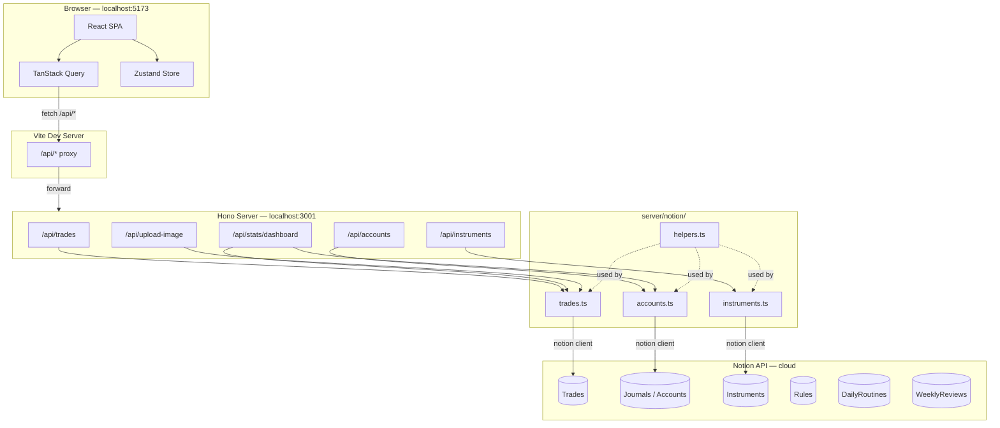
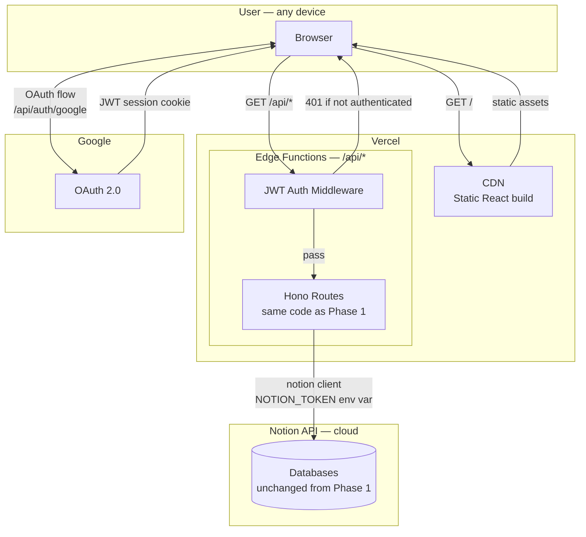
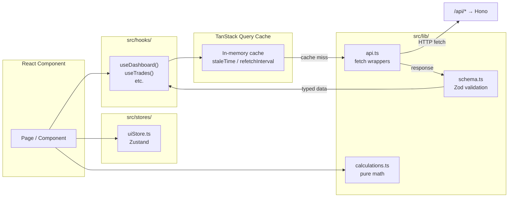
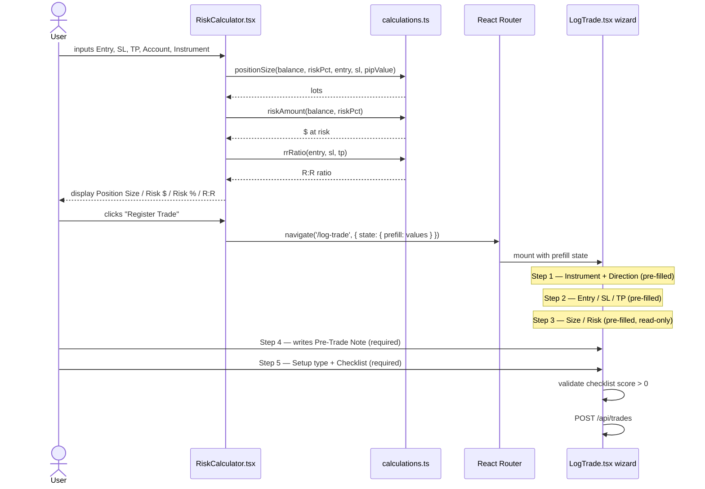
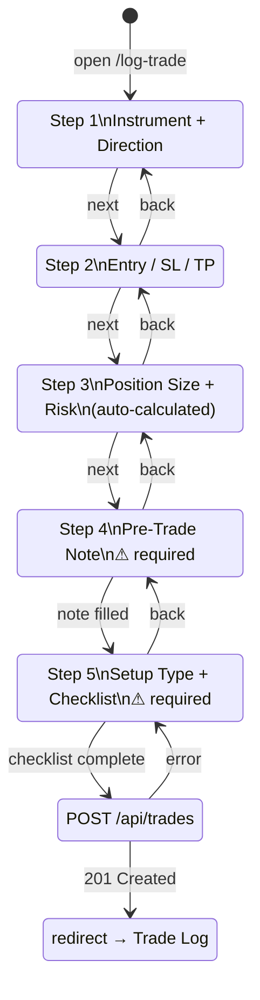
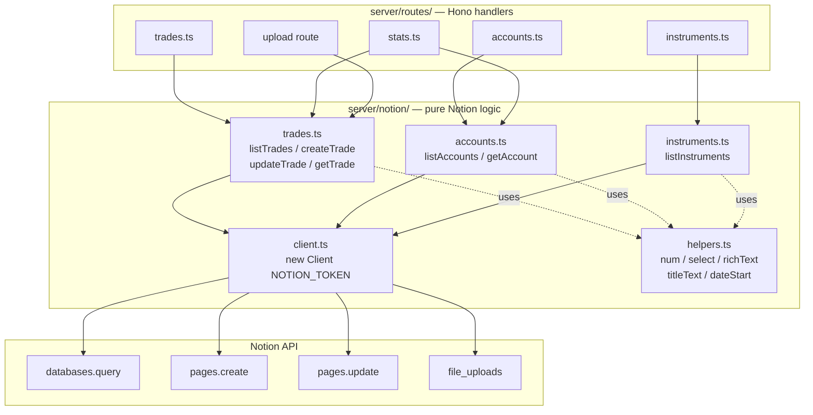
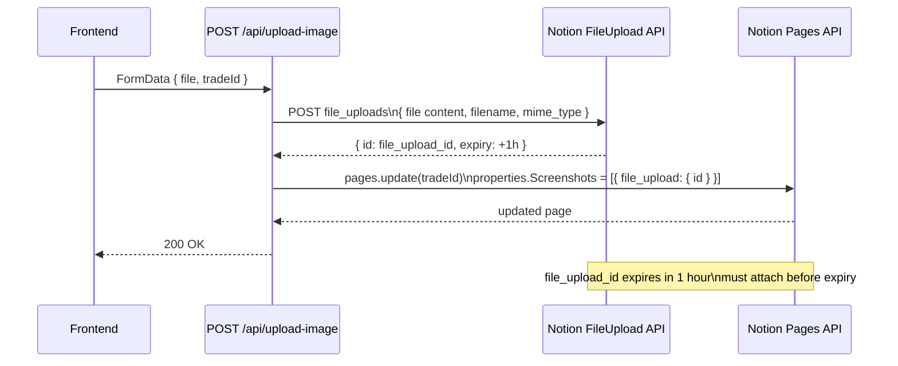
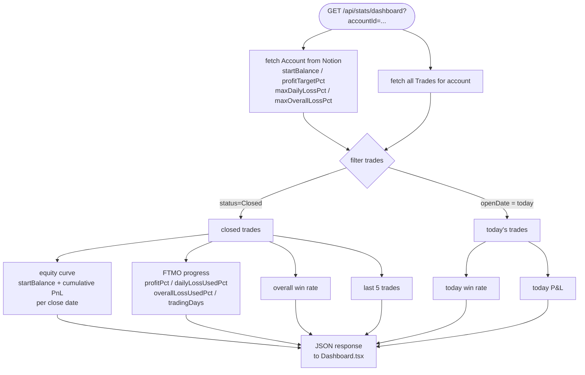

# Architecture Diagrams

---

## 1. System Overview — Phase 1 (Local)

---

## 2. System Overview — Phase 2 (Production)

---

## 3. Frontend Data Flow

---

## 4. Risk Calculator → Register Trade Flow

---

## 5. Log Trade Wizard — Step Flow

---

## 6. Server Internal Structure

---

## 7. Image Upload Flow

---

## 8. FTMO Dashboard Metrics Calculation

